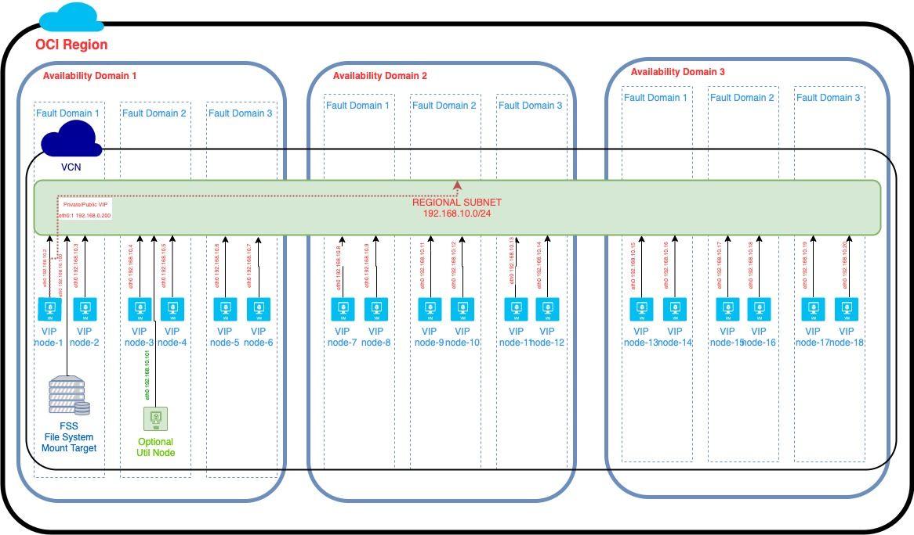

# Oracle Cloud Infrastructure Architecture VIP

## Introduction

The [Oracle Cloud Infrastructure (OCI) Quick Start](https://github.com/oracle?q=quickstart) is a collection of examples that allow OCI users to get a quick start deploying advanced infrastructure on OCI.


This terraform automation provisions Floating IP(VIP) emulation on the Oracle Cloud Infrastructure(OCI).

The number of cluster nodes is configurable. The automation will evenly distribute the cluster nodes across all the ADs in the target region and across all the fault domains in an AD.

Optionally you'll be able to add a File System Service and mount it as an NFS mount on all the cluster nodes.

All the cluster nodes will have a boot volume and an aditional block volume that will be mounted under a configurable mount point.

All the cluster nodes will be configured with Apache or Nginx, keepalived(for cluster management, using VRRP in unicast mode), python and a custom python script using instance principal authentication. The python script will call the OCI REST API to claim the private/public IP to it's vnic as 2nd IP when it will be invoked by the local keepalived process.

An utility VM will be optionally provisioned into the subnet for VIP testing reasons.

A volume group will be created on each and every AD where cluster nodes were created. To an AD volume group all boot and block volumes of the cluster nodes running on that AD will be added. 

The automation will create a regional subnet inside a given(existing) VCN. All the cluster nodes and the FSS mount target will be added to this subnet.

An NSG that contains rules to allow egress to everywhere over any protocol and ingress for VRRP from subnet CIDR, ICMP from subnet CIDR and TCP for ssh(22), http(80) and https(443) from anywhere.

At the subnet level will have a security list for FSS that allows just the VMs exposed to the subnet to mount the NFS mounts FSS is exposing.

A private IP that will have a public IP attached will be created. They both will play the role of a private/public VIP. The private VIP will be attached to the master keepalived node. When the master keepalived node will change, the new master will claim(attach the private/public VIP to its vnic) by calling the custom python script.

It will also provision all the IAM constructs needed by the cluster nodes to make REST API calls to the OCI REST API by using Instance Principals authentication method. The artifacts being provisioned will be:
- a Dynamic Group containing the OCIDs of all the cluster nodes
- Security Policies that will allow the Dynamic Group above to manage VNICs and Private IPs.

## Short Description and Example

This automation is performing the following steps:

 - provisioning a subnet inside a given VCN
 - configuring the routing tables, network security groups, security lists and DHCP for that subnet
 - provisioning a given number of cluster nodes toghether with an optional utility VM. 
 - provision the Dynamic Group and create the specific Dynamic Group policy to allow the cluster nodes instance principals to run rest API calls for migrating the private IP from one vnic to another
 - provisioning a 2nd private IP with an attached public IP. Those will serve as public and private VIPs.
 - on each vm creating and mounting a 2nd block volume of a given size and on a given mount point.
 - Optionaly, create a file system to act as an NFS Share to be shared and mounted across the cluster nodes. An initial snapshot will be performed against the mount.    
 - on top of the cluster nodes it is installing and configuring:
	 - then network alias for the private VIP
	 - mounting via ISCI the 2nd block volume
	 - installing/configuring the specified product Apache/Nginx
	 - installing/configuring keepalived
	 - installing/configuring the python script that is used by keepalived to float the private/public IP to the new Master node.

The script is invoked by the unicast keepalived mechanism, when a node state is changed from BACKUP to MASTER.

## Prerequisites

First off we'll need to do some pre deploy setup.  That's all detailed [here](https://github.com/oracle/oci-quickstart-prerequisites).


## Getting Started

A fully-functional example has been provided in the `root` directory

```bash
$ terraform init
$ terraform plan
$ terraform apply -state <your-state-file>.tfstate
```

Bellow you can find an example of the input parameters:
- Authentication parameters: `terraform.tfvars.template`:

```

#
# 1. Download and install TerraForm (https://www.terraform.io/downloads.html)
# 2. Download and install the OCI TerraForm provider (https://github.com/oracle/terraform-provider-oci/)
# 3. Make sure that you have an OCI API key setup
#       See https://docs.us-phoenix-1.oraclecloud.com/Content/API/Concepts/apisigningkey.htm for directions on creating an API signing key
#       See https://docs.us-phoenix-1.oraclecloud.com/Content/Identity/Tasks/managingcredentials.htm on how to manage API keys in the OCI UI or API
# 4. Copy your tenancy OCID below (bottom part of OCI screen, after Tenancy OCID: heading)
# 5. Copy your OCI user account OCID (login to OCI > Identity > Users)
# 6. Copy the required API key fingerprint and private key path (below)
# 7. Fill-in the full path to the SSH public and private keys (this can be used when creating new instances)
#       See https://docs.us-phoenix-1.oraclecloud.com/Content/GSG/Tasks/creatingkeys.htm for directions on how to create this key pair
#
# HELPFUL URLs
# * https://github.com/oracle/terraform-provider-oci/blob/master/docs/Table%20of%20Contents.md
#

# RUNNING Terraform
#
# Once you've gone through the steps mentioned above, you need to populate your environment variables, by sourcing this file... steps are below:
# 1. Modify this file (so it reflects your OCIDs, etc.)
# 2. $ terraform init
#       You only have to do this once after installing or upgrading your TerraForm plugins
# 3. $ terraform plan
#       This will show you what TerraForm might do if you applied it
# 4. $ terraform apply

#############################
# TENANCY DETAILS
#############################

# Get this from the bottom of the OCI screen (after logging in, after Tenancy ID: heading)
tenancy_id = "<tenancy-idt>"

# Get this from OCI > Identity > Users (for your user account)
user_id = "<user-ocid>"

# the fingerprint can be gathered from your user account (OCI > Identity > Users > click your username > API Keys fingerprint (select it, copy it and paste it below))
fingerprint = "<fingerprint>"

# this is the full path on your local system to the private key used for the API key pair
private_key_path = "<private-key-path>"

# region (us-phoenix-1, ca-toronto-1, etc)
region = "eu-frankfurt-1"
```

- Configuration parameters `vip.auto.tfvars`:

```

##############################
# TENANCY DETAILS
#############################

# default compartment 
default_compartment_id = "<default_compartment_ocid>"

# iam compartment - if null then default_compartment_id will be used
iam_compartment_id = null

#############################
# naming convension
#############################

# the prefix that will be used for all the names of the OCI artifacts that this automation will provision
names_prefix = "oci-vip-nginx"

# the defined tags to be used for all the artifacts that this automation will provision
defined_tags = {}

# the freeform tags to be used for all the artifacts that this automation will provision
freeform_tags = {}

#############################
# volumes - block storage
#############################

# block storage compartment - if null then default_compartment_id will be used
block_storage_compartment_id = null

# The aditional block volumes backup policy: Bronze, Silver or Gold. Default = Bronze. Null = Bronze
volumes_backup_policy = null

# The aditional block volumes mount point
aditional_block_volume_mount_point = "/u01"

# The aditional block volumes size
aditional_block_volume_size = 55

#############################
# OCI VIP network
#############################

# The specific network compartment id. If this is null then the default, project level compartment_id will be used.
network_compartment_id = null

# the VCN id where the VIP network components will be provisioned
vcn_id = "<vcn-ocid>"

# the route table attached to the VIP subnet. Configuration supports both public internet routes and private routes
oci_vip_route_table = {
  route_rules = [{
    # route to public internet ("0.0.0.0/0") or to private destination
    dst      = "0.0.0.0/0"
    dst_type = "CIDR_BLOCK"
    # next hop can be an Internet Gateway or other Gateway(ex. DRG)
    next_hop_id = "<IG-OCID>"
  }]
}

# VIP subnet DHCP options
dhcp_options = {
  oci_vip_dhcp_option = {
    server_type        = "VcnLocalPlusInternet"
    search_domain_name = "DomainNameServer"
    forwarder_1_ip     = null
    forwarder_2_ip     = null
    forwarder_3_ip     = null
  }
}

# VIP subnet CIDR
oci_vip_subnet_cidr = "10.0.80.0/24"

# option for having a public and private VIP or just a private VIP
assign_public_ip = true

#############################
# File System Details
#############################

# The specific FSS compartment id. If this is null then the default, project level compartment_id will be used.
fss_compartment_id = null

# The FSS configuration. If null(file_system = null) then no FSS artifacts will not be configured
file_system = {
  # the File Sytem and mount target AD - AD number
  availability_domain = 1
  export_path         = "/u02"
}

# the folder(mount point) where the FSS NFS share will be mounted
fss_mount_point = "/u02"

#############################
# OCI VIP Instances
#############################

# The specific compute compartment id. If this is null then the default, project level compartment_id will be used.
compute_compartment_id = null

# The number of cluster nodes to be provisioned
cluster_size = 6

# Compute instances ssh public key
ssh_public_key_path = "<ssh-public-key>"

# Compute instances ssh private key
ssh_private_key_path = "<ssh-private-key>"

# The name of the shape to be used for all the provisioned compute instances. The automation will automatically figure out the OCID for the specific shape name in the target region.
shape = "VM.Standard2.1"

# The name of the image to be used for all the provisioned compute instances. The automation will automatically figure out the OCID for the specific image name in the target region.
image_name = "Oracle-Linux-7.7-2019.10.19-0"


# OCI VIP Config

# Accepted values: ["Apache", "Nginx"] 
install_product = "Nginx"

# Keepalived check script
# Only 2 values are accepted:
# - "'/usr/sbin/pidof httpd'"
# - "'/usr/sbin/pidof nginx'"
keepalived_check = "'/usr/sbin/pidof nginx'"

#############################
# OCI VIP Util Nodes
#############################

# Option to have an util compute node provisioned or not.
provision_util_node = false
```


## High level diagrams

### Regional Deployment



## Current limitations

* Currently the automation does ***not*** support:
  * updating the number of cluster nodes after the initial provisioning. To update the number of cluster nodes you will need to destroy and re-apply.
  * changing/updating the installed product(Apache/Nginx) after the initial provisioning. To update the installed product you will need to destroy and re-apply.

## Versions

This module has been developed and tested by running terraform on macOS Mojave Version 10.14.6

```
user-mac$ terraform --version
Terraform v0.12.13
+ provider.null v2.1.2
+ provider.oci v3.50.0
+ provider.random v2.2.1
+ provider.oci v3.31.0
```

## GitHub Action Workflow - Automated Packaging

This project uses [GitHub Action Workflow](https://github.com/features/actions) that automatically generates a OCI Resource Manager Stack everytime there is a code change. A new ORM Stack file is hosted under GitHub Releases as a draft. Publishers can modify each Release individually or change the parameters at [ORM Stack](.github/workflows/build-orm-stack.yml) workflow Create Release step to make it public to everyone.

```yaml
 - name: Create Release
        id: create_release
        uses: actions/create-release@v1
        env:
          GITHUB_TOKEN: ${{ secrets.GITHUB_TOKEN }}
        with:
          tag_name: ${{ github.ref }}
          release_name: Release ${{ github.ref }}
          body: |
            Changes in this Release
            - New ORM Stack template ${{ github.ref }}
          draft: true
          prerelease: true
```

## Contributing

This project is open source. Oracle appreciates any contributions that are made by the open source community.

## License

Copyright (c) 2020, Oracle and/or its affiliates.

Licensed under the Universal Permissive License v 1.0 as shown at https://oss.oracle.com/licenses/upl.

See [LICENSE](LICENSE) for more details.